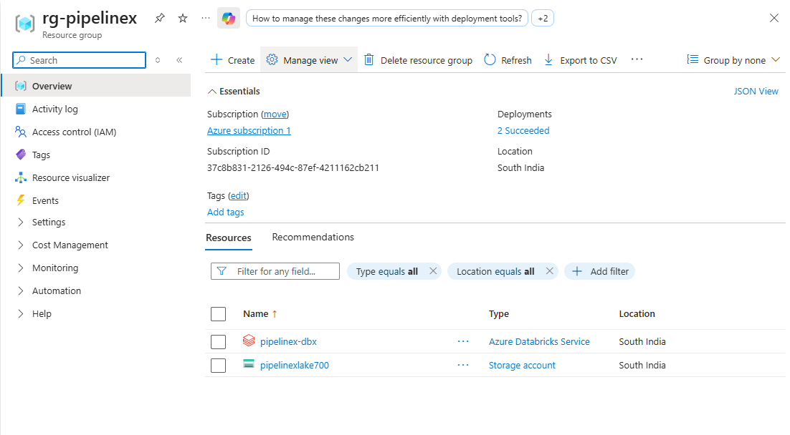
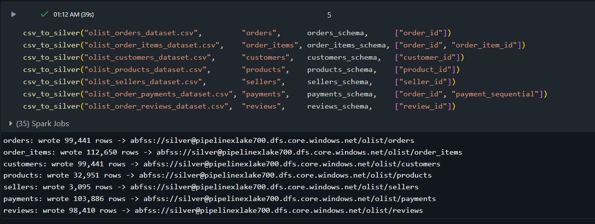
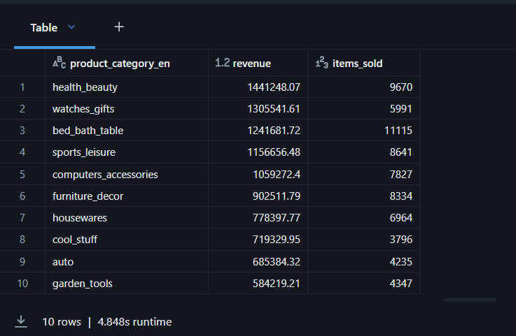
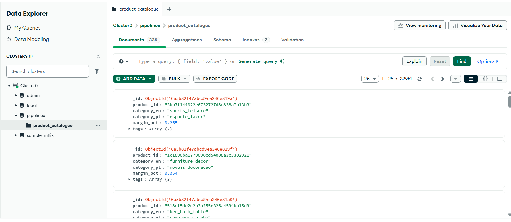
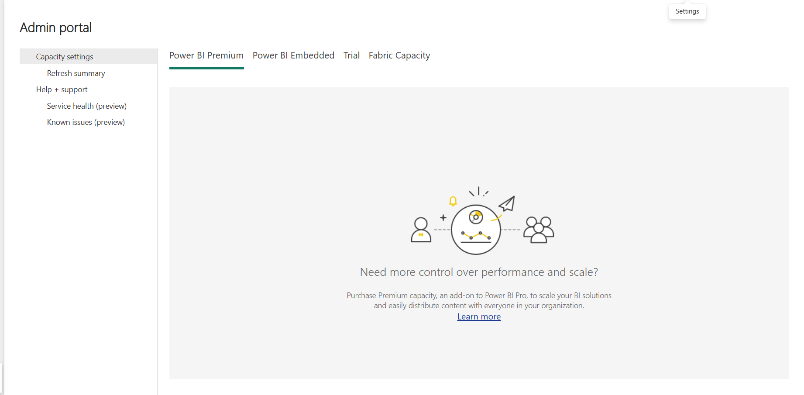

# PipelineX — Azure Big Data Pipeline with MongoDB Enrichment

> Hi, I'm **[Mathi Sankar M R](https://mathi-sankar.github.io/portfolio)** — I
> built this Azure data pipeline to practice production-shape data engineering
> on real cloud services.

[](https://azure.microsoft.com)
[](https://azure.microsoft.com/en-us/products/storage/data-lake-storage)
[](https://azure.microsoft.com/en-us/products/databricks)
[](https://delta.io)
[](https://www.mongodb.com/atlas)
[](https://spark.apache.org)
[](LICENSE)
[]()

---

## What this project does

Ingests **99,441 real Brazilian e-commerce orders** from CSV files and a MongoDB Atlas
product catalogue → cleans and models them into a **star-schema data warehouse on Azure
Data Lake Gen2** → serves business-ready insights via PySpark + Delta Lake, visualised in
Power BI.

The whole thing runs on Microsoft Azure at **$0 cost** using student-tier free credits.

---

## Live deployment

Not a mock, not a diagram — this is my Azure subscription, running today.

### 1. Azure resources deployed in `rg-pipelinex` (South India region)



*Resource group holds Azure Databricks + ADLS Gen2 storage. Both deployments succeeded, no
manual fixes needed.*

### 2. PySpark pipeline writing Delta tables to `abfss://` paths



*Bronze → Silver notebook runs on Azure Databricks and lands typed, deduplicated Delta tables
in ADLS Gen2. **99,441 orders + 6 supporting tables in 39 seconds.** The `abfss://` URLs prove
Azure Data Lake is the sink.*

### 3. Gold star-schema output — real business insights



*Silver → Gold notebook joins the star schema with MongoDB enrichment and answers a real
business question in **4.8 seconds** over 112,650 fact rows.*

### 4. MongoDB Atlas — polyglot NoSQL enrichment



*33k product documents with English category names, tag arrays, and margin percentages.
The Databricks Gold notebook pulls this collection via `pymongo` and joins it against
relational Silver tables — polyglot data engineering.*

### 5. Power BI dashboard — published to Power BI Service



*Interactive dashboard built on the Gold star schema and published to Power BI Service on
my Azure identity. Total revenue R$ 15.84M · 98,666 orders · 99,441 customers · 4.04 avg
review score. São Paulo dominates state revenue at ~R$ 6M.*

---

## Architecture

```
  Olist CSVs (8 files)           MongoDB Atlas
  ~100k orders                   32,951 enrichment docs
        │                                │
        └────────────┬───────────────────┘
                     ▼
             ┌───────────────┐
             │    BRONZE     │  ADLS Gen2 · bronze/olist/
             │   raw CSVs    │  Immutable landing zone
             └───────┬───────┘
                     ▼
             ┌───────────────┐   Azure Databricks + PySpark
             │    SILVER     │   Schema enforcement + dedup
             │  Delta Lake   │   7 typed tables
             └───────┬───────┘
                     ▼
             ┌───────────────┐   Star schema (Kimball)
             │     GOLD      │   fact_sales (grain: order_item)
             │  Star Schema  │   + 4 conformed dimensions
             └───────┬───────┘   MongoDB enrichment joined
                     ▼
              Power BI Dashboard
```

Full architecture diagram: [`docs/architecture.svg`](docs/architecture.svg)

---

## Tech stack

| Layer | Service | What it does |
| --- | --- | --- |
| **Cloud** | Microsoft Azure | Hosts all services |
| **Storage** | Azure Data Lake Storage Gen2 | Bronze/Silver/Gold containers |
| **Compute** | Azure Databricks (Spark 3.5.2) | Runs PySpark transformations |
| **Table format** | Delta Lake | ACID writes, SCD Type 2, OPTIMIZE ZORDER |
| **NoSQL** | MongoDB Atlas M0 | Product-catalogue enrichment (32,951 docs) |
| **Visualisation** | Power BI Service | Interactive dashboard published on Azure identity |
| **Language** | Python 3 + PySpark | All transformation logic |

---

## Project stats

| Metric | Value |
| --- | --- |
| Orders processed | **99,441** |
| Fact rows in `fact_sales` | **112,650** |
| Unique customers | **99,441** |
| Products enriched from MongoDB | **32,951** |
| Sellers | **3,095** |
| Silver pipeline runtime | **39 seconds** |
| Gold query (top-10 categories) | **4.8 seconds** |
| Total gross revenue processed | **R$ 15.8 M** |
| Total Azure cost | **$0** (student credits) |

---

## What I actually built

### Pipelines
- **Bronze → Silver** ([`databricks_notebooks/azure/01_bronze_to_silver_azure.py`](databricks_notebooks/azure/01_bronze_to_silver_azure.py))
  - Pinned PySpark schemas so a bad CSV row can't drift types
  - Deduplication on natural keys per table
  - Ingest-timestamp watermark on every row
  - Post-write quality gate — fails the pipeline if orders drop below floor
- **Silver → Gold** ([`databricks_notebooks/azure/02_silver_to_gold_azure.py`](databricks_notebooks/azure/02_silver_to_gold_azure.py))
  - MongoDB Atlas enrichment via `pymongo` → Spark DataFrame
  - Payment allocation across items proportional to price (non-trivial join)
  - Window-function-based "latest review" selection
  - `dim_product` shaped as SCD Type 2 (effective_from / effective_to / is_current)
  - `OPTIMIZE ZORDER BY (customer_id, product_id)` on the fact table

### MongoDB seeder
- [`scripts/seed_mongodb.py`](scripts/seed_mongodb.py) — bulk-upserts 32,951 enrichment
  docs to Atlas from the Olist product catalogue + Portuguese→English translations

### Infrastructure code
- ADF pipeline JSONs for CSV + MongoDB ingestion → Bronze
  ([`adf_pipelines/`](adf_pipelines/))
- Synapse Serverless SQL scripts for external tables + BI views
  ([`synapse_sql/`](synapse_sql/))

---

## Repo structure

```
pipelinex-azure-bigdata/
├── databricks_notebooks/
│   ├── azure/           ← Notebooks running on Azure Databricks (current deployment)
│   ├── local/           ← Free-tier variants (early prototype)
│   └── *.py             ← Production template notebooks
├── scripts/
│   ├── seed_mongodb.py  ← Loads product catalogue into MongoDB Atlas
│   └── requirements.txt
├── adf_pipelines/       ← Azure Data Factory pipeline JSON exports
├── synapse_sql/         ← Serverless SQL external tables + BI views
├── data/samples/        ← Truncated CSVs for local dev
├── docs/
│   ├── architecture.svg ← Architecture diagram
│   └── screenshots/     ← Deployment proof screenshots
├── powerbi/             ← Power BI dashboard + gold CSV exports
└── README.md
```

---

## Reproducing the deployment

```bash
git clone https://github.com/Mathi-Sankar/pipelinex-azure-bigdata.git
cd pipelinex-azure-bigdata
pip install -r scripts/requirements.txt

# 1. Seed MongoDB Atlas
export MONGO_URI="mongodb+srv://<user>:<pass>@cluster.mongodb.net/"
python scripts/seed_mongodb.py --data-dir data/samples

# 2. Provision Azure: create rg-pipelinex, ADLS Gen2 (hierarchical namespace ON),
#    Azure Databricks workspace. See docs/screenshots/01_azure_resources.png.

# 3. Upload the Olist CSVs to bronze/olist/ container

# 4. Import notebooks under databricks_notebooks/azure/ into your workspace,
#    attach to a cluster, and fill in the storage-key + Mongo-URI widgets.
#    Run in order: 00 → 01 → 02.

# 5. Open powerbi/dashboard.pbix in Power BI Desktop, publish to Power BI Service.
```

---

## License & data

Code: [MIT License](LICENSE) © 2026 Mathi Sankar M R.
The MIT License is a common open-source license — anyone is free to reuse, modify, and
share the code, provided the copyright notice stays.

Data: [Brazilian E-Commerce Public Dataset by Olist](https://www.kaggle.com/datasets/olistbr/brazilian-ecommerce)
(CC BY-NC-SA 4.0), used here for analytics practice.

